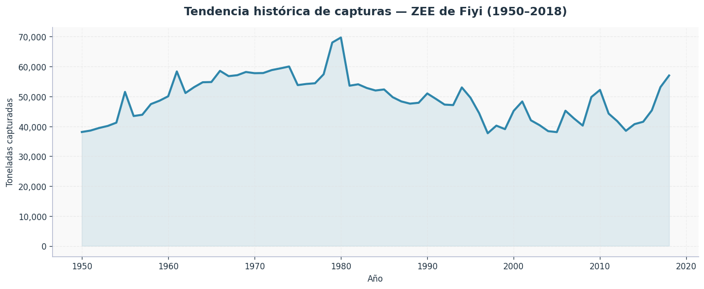
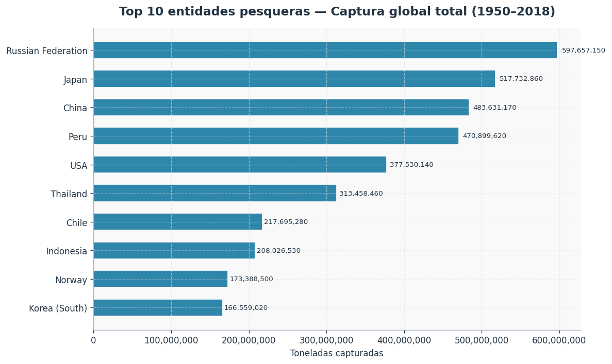
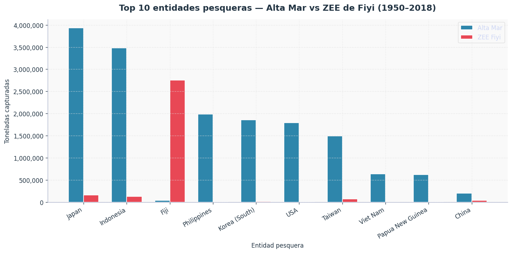

# Dashboard Notes — Visualizaciones del Proyecto

**Sistemas Intensivos en Datos — 2026-1 — Universidad EAFIT**

---

## 1. Herramientas utilizadas

Las visualizaciones se generaron con **Python 3** usando las librerías `pandas` (carga y manipulación de datos) y `matplotlib` (generación de gráficas). Los datos de entrada son los resultados exportados en CSV directamente desde Amazon Athena. El notebook `visualizaciones.ipynb` en esta carpeta contiene el código completo y reproducible de las tres gráficas.

Se eligió este stack sobre Amazon QuickSight por simplicidad de setup y porque los datos ya estaban disponibles localmente como CSV, lo que no requería mantener una conexión activa a la consola de AWS para la etapa de visualización.

---

## 2. Gráficas generadas

### 2.1 Tendencia histórica de capturas — ZEE de Fiyi (1950–2018)

**Archivo:** `grafica_01_tendencia_fiji.png`
**Tipo:** Serie de tiempo (línea con área rellena)
**Fuente de datos:** tabla `eez`, consulta `02_tendencia_historica_fiji.sql`

**Decisiones de diseño:**

- Se usa una línea continua con área sombreada para enfatizar la acumulación histórica y hacer más visible la tendencia general.
- El eje Y arranca en 0 para no distorsionar la percepción de la magnitud de los cambios.

**Hallazgos observados:**

- Las capturas en la ZEE de Fiyi se mantuvieron relativamente estables entre 1950 y 1975, en un rango de 40,000–60,000 toneladas anuales.
- Se observa un pico pronunciado alrededor de 1980, alcanzando aproximadamente 70,000 toneladas, el valor más alto de toda la serie.
- Tras ese pico se produce una caída gradual durante las décadas de 1980 y 1990, con el punto más bajo cerca de 1998 (~38,000 toneladas).
- Desde 2000 la tendencia es de recuperación moderada, cerrando en 2018 con valores cercanos al pico histórico.

---

### 2.2 Top 10 entidades pesqueras — Captura global total (1950–2018)

**Archivo:** `grafica_02_top10_global.png`
**Tipo:** Barras horizontales
**Fuente de datos:** tabla `global`, consulta `01_top10_entidades_valor_global.sql`

**Decisiones de diseño:**

- Se usan barras horizontales para facilitar la lectura de los nombres de los países.
- Las barras están ordenadas de mayor a menor captura (de arriba hacia abajo).
- Se incluyen etiquetas numéricas al final de cada barra para dar referencia exacta sin necesidad de leer el eje.

**Hallazgos observados:**

- La Federación Rusa lidera la captura global acumulada con aproximadamente 597 millones de toneladas, seguida por Japón (~518 M) y China (~484 M).
- Perú aparece en cuarto lugar (~471 M), lo que refleja el peso histórico de su industria anchovelera.
- Los 10 primeros países concentran la gran mayoría de las capturas globales registradas entre 1950 y 2018.

---

### 2.3 Alta Mar vs ZEE de Fiyi — Top 10 entidades pesqueras (1950–2018)

**Archivo:** `grafica_03_altamar_vs_zee.png`
**Tipo:** Barras agrupadas
**Fuente de datos:** tablas `highseas` y `eez`, consulta `03_cruce_highseas_vs_eez_por_entidad.sql`

**Decisiones de diseño:**

- Se muestran las top 10 entidades por captura total en la región del Pacífico Central Occidental para no sobrecargar el eje X.
- Las barras azules representan capturas en alta mar y las rojas en la ZEE de Fiyi, permitiendo comparación directa por entidad.
- Los colores se mantienen consistentes con el resto del proyecto (azul = alta mar, coral = ZEE).

**Hallazgos observados:**

- Japón e Indonesia son los mayores pescadores en alta mar dentro de esta región, con capturas muy superiores a su presencia en la ZEE de Fiyi.
- Fiyi es el único país donde la barra de la ZEE supera ampliamente a la de alta mar, lo que tiene sentido: pesca principalmente dentro de sus propias aguas territoriales.
- Países como Filipinas, Corea del Sur y Taiwán tienen presencia significativa en alta mar pero mínima en la ZEE de Fiyi, lo que sugiere flotas de pesca de altura que operan lejos de sus costas.

---

## 3. Paleta de colores y estilo

| Elemento                        | Color                          | Hex       |
| ------------------------------- | ------------------------------ | --------- |
| Líneas y barras principales     | Azul oceánico                  | `#2E86AB` |
| Barras ZEE / acento comparativo | Coral                          | `#E84855` |
| Textos secundarios y ejes       | Gris medio                     | `#6c757d` |
| Fondo de ejes                   | Gris muy claro                 | `#f9f9f9` |
| Grillas                         | Líneas punteadas, 60% opacidad | —         |

Se desactivaron los bordes superior y derecho de cada gráfica (`spines`) para un estilo más limpio. Todos los ejes numéricos usan separador de miles para mejorar la legibilidad.

---

## 4. Archivos generados

| Archivo                         | Descripción                                          |
| ------------------------------- | ---------------------------------------------------- |
| `visualizaciones.ipynb`         | Notebook con el código completo de las tres gráficas |
| `grafica_01_tendencia_fiji.png` | Serie de tiempo — ZEE de Fiyi                        |
| `grafica_02_top10_global.png`   | Top 10 entidades — captura global                    |
| `grafica_03_altamar_vs_zee.png` | Comparación alta mar vs ZEE, región Pacífico         |

---

*Universidad EAFIT — Ingeniería de Sistemas — 2026-1*
